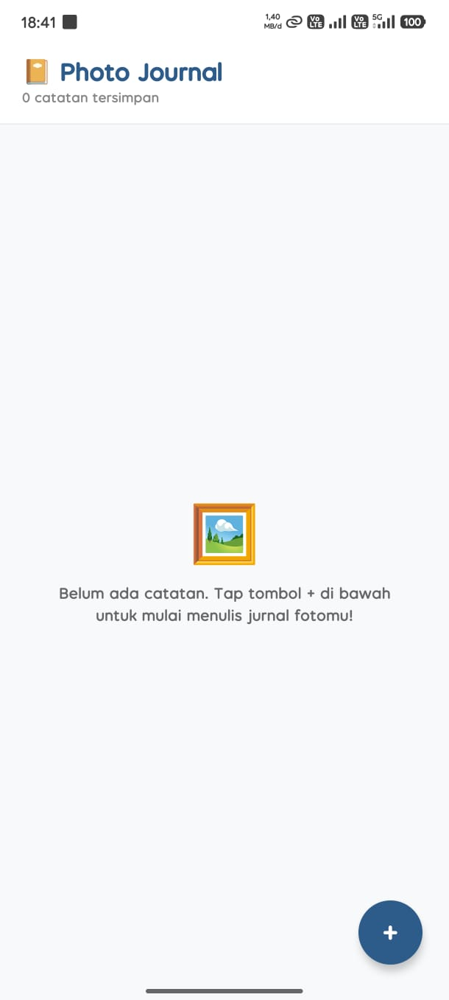
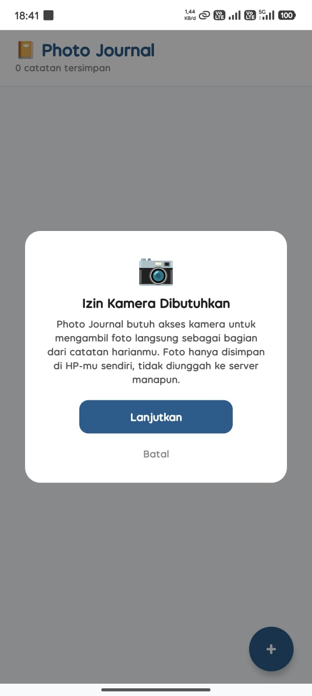
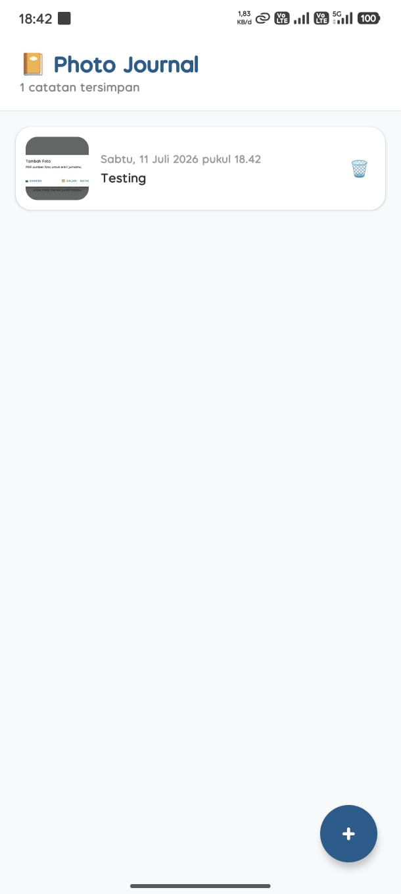

# 📔 Photo Journal

Aplikasi mobile (Expo / React Native) untuk mencatat jurnal harian dengan foto — ambil dari kamera atau galeri, tulis catatan singkat, dan semua entri tersimpan otomatis di HP-mu.

Dibuat untuk **Mission 13: Native Power App**.

---

## 📸 Fitur Native yang Dipakai

- **Kamera & Galeri** (`expo-image-picker`) — mengambil / memilih foto dengan permission flow yang benar.

## ✅ Level 1 — Fitur Wajib (Core)

- [x] Akses fitur native (kamera & galeri)
- [x] Permission flow: request izin → cek `status === 'granted'` → akses fitur
- [x] Penolakan izin ditangani dengan pesan ramah (`Alert` + tombol Pengaturan), tanpa crash
- [x] Cek `result.canceled` sebelum mengambil `result.assets[0].uri`
- [x] Foto ditampilkan lewat `Image` dengan dimensi eksplisit
- [x] UI rapi menampilkan hasil (kartu jurnal + modal detail)

## 🟡 Level 2 — Fitur Pengembangan (3 dari minimal 2)

- [x] **Kamera + Galeri** — saat tap "+", muncul pilihan sumber foto (Kamera / Galeri) lewat `Alert`.
- [x] **Persistensi** — setiap entri jurnal (foto + catatan + tanggal) disimpan ke `AsyncStorage` dan dimuat ulang otomatis saat app dibuka.
- [x] **Galeri Multi-Foto** — seluruh entri ditampilkan dalam `FlatList`, bisa terus bertambah tanpa batas.

## 🔴 Level 3 — Bonus

- [x] **Priming screen** — modal penjelasan alasan izin kamera/galeri dibutuhkan, ditampilkan *sebelum* dialog izin native sistem muncul (saat status `undetermined`).
- [x] **Hapus foto** — setiap entri bisa dihapus dari kartu list maupun dari layar detail, dengan konfirmasi `Alert`.
- [x] **`app.json` lengkap** — usage description untuk `NSCameraUsageDescription`, `NSPhotoLibraryUsageDescription` (iOS) dan permission Android (`CAMERA`, `READ_MEDIA_IMAGES`, dst) sudah dikonfigurasi.

---

## 🖼️ Screenshot

> Ganti placeholder di bawah ini dengan screenshot asli dari HP fisikmu sebelum submit.

| Priming Screen | Dialog Izin Native | List Jurnal | Penolakan Izin |
|---|---|---|---|
|  |  |  |  |

---

## 🛠️ Tech Stack

- [Expo SDK 54](https://docs.expo.dev/) (React Native `0.81`, React `19.1`)
- `expo-image-picker` — akses kamera & galeri
- `@react-native-async-storage/async-storage` — persistensi lokal entri jurnal

---

## ▶️ Cara Menjalankan

1. Pastikan sudah menginstal [Node.js](https://nodejs.org/) dan aplikasi **Expo Go** di HP-mu (Android/iOS).
2. Clone repo ini lalu masuk ke folder project:
   ```bash
   git clone https://github.com/fariidd04/photo-journal.git
   cd photo-journal
   ```
3. Install dependencies:
   ```bash
   npm install
   ```
4. Jalankan server pengembangan:
   ```bash
   npx expo start
   ```
5. Scan QR code yang muncul di terminal/browser menggunakan aplikasi **Expo Go** di HP-mu.

---

## 🔗 Expo Snack

Coba langsung di browser tanpa install apa pun:
👉 **[[Expo Snack](https://snack.expo.dev/@fariid.dd/photo-journal?platform=android)]**

> Catatan: kamera tidak berfungsi di simulator/web Expo Snack — gunakan opsi "Galeri" saat mencoba lewat Snack, dan tes fitur kamera di HP fisik lewat Expo Go.

---

## 📂 Struktur Project

```
photo-journal/
├── App.js            # Seluruh logic & UI aplikasi
├── app.json          # Konfigurasi Expo + usage description permission
├── babel.config.js
├── package.json
└── README.md
```

---

## 🔒 Catatan Privasi

Foto dan catatan jurnal hanya disimpan secara lokal di HP pengguna lewat `AsyncStorage` — tidak ada data yang dikirim ke server manapun. Setiap entri dapat dihapus kapan saja oleh pengguna langsung dari dalam app.